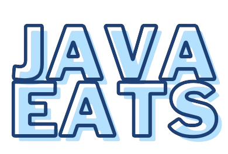

# Projecto Temático em Desenvolvimento de Aplicações

<p align="center">
  
</p>

# **JavaEats - Sistema de Gestão para Restaurantes**

O JavaEats é uma aplicação desenvolvida como parte integrante do Projeto Temático em Desenvolvimento de Aplicações da Licenciatura em Tecnologias da Informação da Escola Superior de Tecnologia e Gestão de Águeda (ESTGA) da Universidade de Aveiro. Este sistema de gestão para estabelecimentos de restauração foi projetado para otimizar e simplificar processos como gestão de pedidos, reservas, pagamentos, faturação e muito mais.

## **🚀 Objetivos do Projeto**
- **Eficiência Operacional**: Automatizar processos de pedidos, reservas e pagamentos, minimizando erros e aumentando a produtividade.
- **Gestão Simplificada**: Fornecer aos gerentes uma visão clara e centralizada do estado do restaurante, com dashboards intuitivos.
- **Estatísticas e Relatórios**: Disponibilizar ferramentas de análise para uma gestão baseada em dados, incluindo gráficos de vendas, popularidade de itens e métodos de pagamento utilizados.
- **Inovação**: Implementar login por tags RFID, substituindo métodos tradicionais e proporcionando maior comodidade.

---

## **💻 Pré-requisitos**
Antes de começar, certifique-se de que possui:
- **Java JDK**: [Download Java JDK](https://www.oracle.com/java/technologies/downloads/)
- **Java Runtime Environment (JRE)**: [Download Java](https://www.java.com/pt-BR/download/ie_manual.jsp?locale=pt_BR)

---

## **📦 Instalação do JavaEats**
### **Método 1: Executável**
1. Aceda ao site: [JavaEats Website](https://kodelabs.me/JavaEats/)
2. Faça o download do instalador.
3. Extraia o ficheiro `JavaEats.zip` e execute o instalador.

### **Método 2: Código Fonte**

```bash
git clone --single-branch --branch desenvolvimento https://github.com/sDanielSilva/JavaEats.git
```

---

## **🔧 Funcionalidades Chave**
- **Gestão de Mesas**: Acompanhe o estado de cada mesa em tempo real (disponível, ocupada, reservada).
- **Gestão de Pedidos**: Permite aos funcionários inserir e editar pedidos rapidamente.
- **Pagamentos Automatizados**: Cálculo automático de totais, troco e divisão de despesas.
- **Estatísticas Detalhadas**: Gráficos de faturação e análises por categoria ou item.
- **Interface Intuitiva**: Desenvolvida com JavaFX, garantindo usabilidade para todos os níveis de utilizadores.

---

## 📝 Documentação
Veja o ficheiro [**JavaEats.pdf**](JavaEats.pdf) para mais informações e detalhes.
  
---

## 🤝 Colaboradores

Colaboradores que fizeram parte deste projeto:

<table>
  <tr>
    <td align="center">
      <a href="https://github.com/lucasduarte2">
        <br>
        <sub>
          <b>Lucas Duarte</b>
        </sub>
      </a>
    </td>
    <td align="center">
      <a href="https://github.com/sDanielSilva">
        <br>
        <sub>
          <b>Daniel Silva</b>
        </sub>
      </a>
    </td>
    <td align="center">
      <a href="https://github.com/BrunoNM18">
        <br>
        <sub>
          <b>Bruno Migueis</b>
        </sub>
      </a>
    </td>
    <td align="center">
      <a href="https://github.com/gcravo">
        <br>
        <sub>
          <b>Gabriel Cravo</b>
        </sub>
      </a>
    </td>
    <td align="center">
      <a href="https://github.com/MPirre">
        <br>
        <sub>
          <b>Miguel Pirré</b>
        </sub>
      </a>
    </td>
  </tr>
</table>
